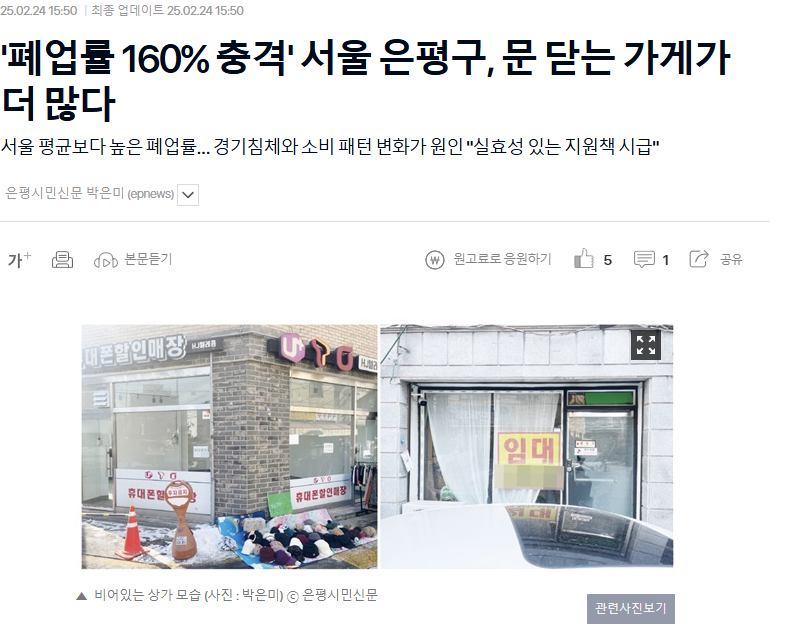
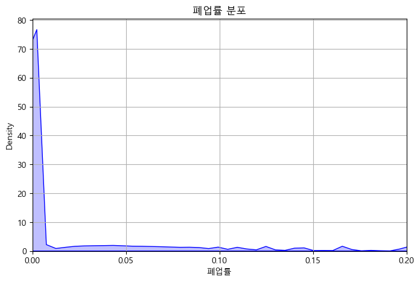
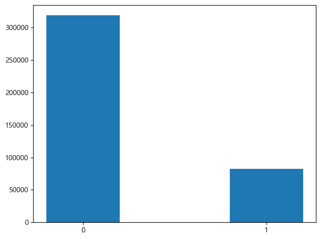
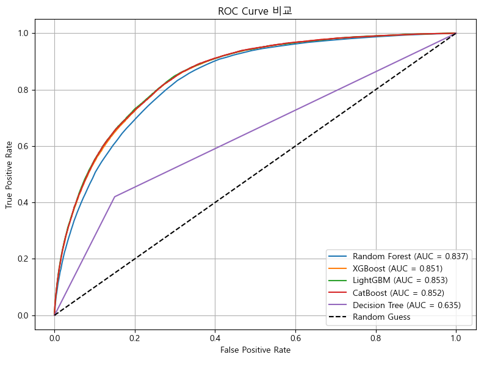
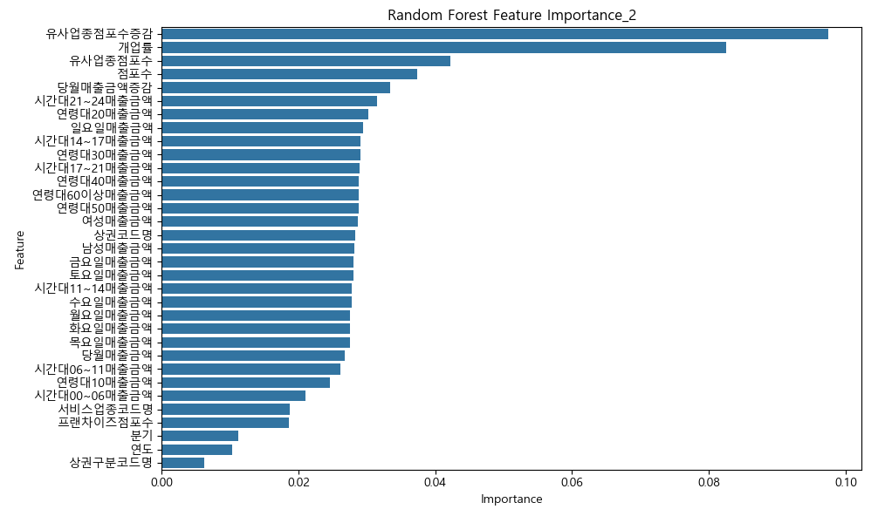
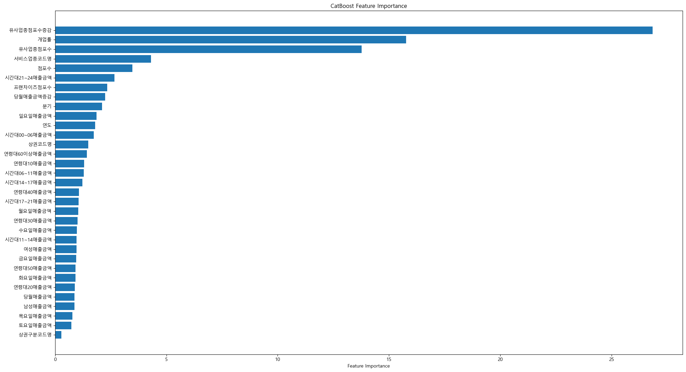
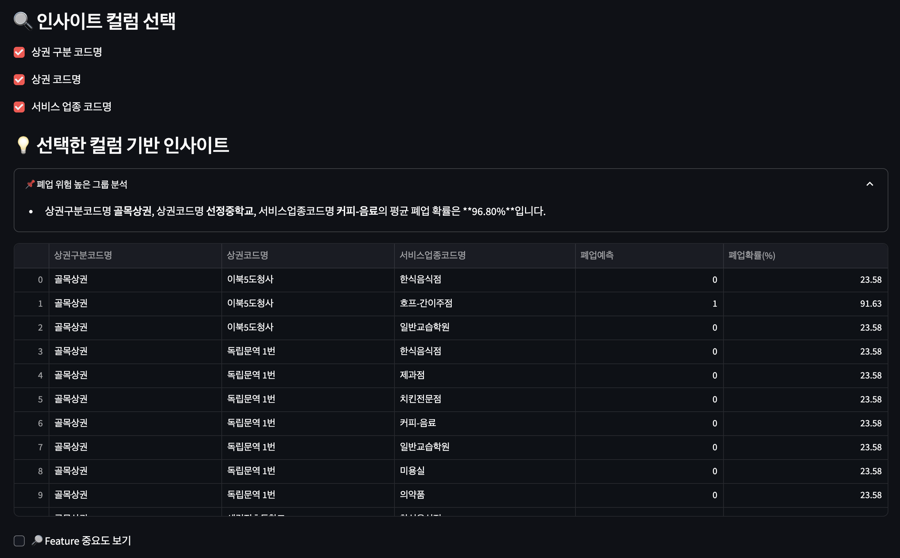
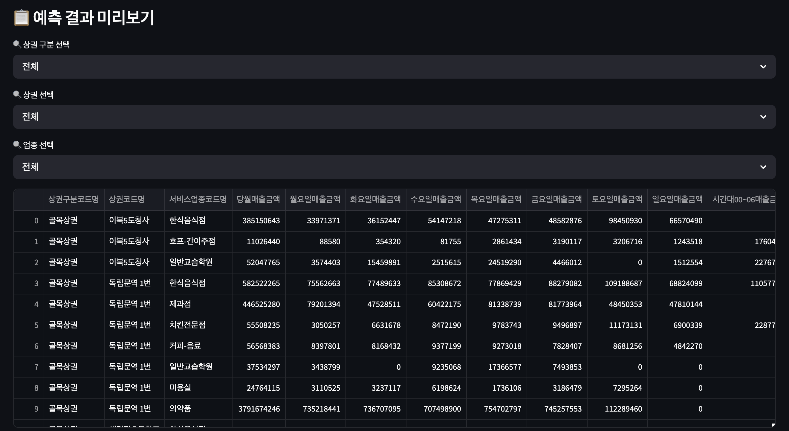
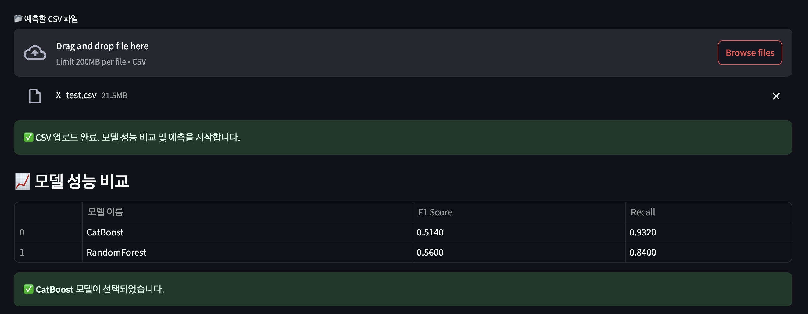

# [SKN13-2nd-4TEAM] 서울특별시 폐업사업자 분류 예측 

## 팀 소개

### 리얼포포


---


| 기원준                     | 이명인                     | 이재범                     | 홍성의                     |
|----------------------------|----------------------------|----------------------------|----------------------------|
| App 개발, Baseline 모델 탐색 | 하이퍼파라미터 튜닝           | EDA&전처리                     | 성능 평가                  |


## 프로젝트 소개

* 기간: 2025.05.15. - 2025.05.16.

* 내용: 서울특별시 상권, 업종 별 폐업 분류 예측 App 개발

* 기대 효과: 폐업에 영향을 주는 요인 분석, 창업 지원 및 자영업 지원 사업에 인사이트 제공

## 배경


<p align="center"><b>[그림 1]</b> 국세통계포털: 폐업자 현황</p>


### 전국 폐업사업자 급증

* 2023년 폐업사업자: 약 **98만 6천 명**.

* 글로벌 금융위기 당시(2008년, 2009년: 각각 84만 명), 코로나 시기보다 심각

* 경기도: 2024년 11월부터 **폐업 > 개업**. 올해 1분기 폐업률은 근 6년 중 최고치(2.85%)



### 원인은?


* **사업부진**

* 업계 전반의 **비용 구조 악화**

* **새로운 소비 행태** 등장(e.g. YONO, You Only Need One)


### 결국 **💸돈💸!!**

: 특정 상권, 특정 업종의 데이터들 중 **매출액** 기반으로 폐업을 예측해볼 수 있지 않을까?
 
<h3 align="center"><b>폐업 분류 예측 App 개발!!</b></h3>

## 디렉토리 구성도

```
SKN13-2nd-4TEAM
├── app.py # Streamlit 앱 코드
├── data
│ ├── expected_sales # 추정 매출 원본 CSV
│ ├── the_number_of_shops # 점포수 관련 원본 CSV
│ └── datasets # 학습/테스트 데이터셋 (X_train 등)
├── modelings # 학습된 모델 및 튜닝 결과 저장
├── preprocessing # 데이터 전처리코드
├── readme_image # README 이미지
├─── 산출물 # 데이터, 모델학습 결과서
│ └── best # 학습시킨 모델 `.joblib` 파일
└── README.md # 프로젝트 개요 문서
```

## 기술 스택

### 프로그래밍 언어


### IDE


### 데이터 정제 및 전처리 라이브러리


### 데이터 시각화 라이브러리


### ML/DL 라이브러리


### 성능 평가 라이브러리


### App


### 형상 관리 및 협업


## ✒️ 연구 방법

1. 탐색적 데이터 분석
2. 데이터 전처리
3. 분류 모델 학습
4. 성능 평가
5. 결론 도출 및 App 개발

## 데이터

### 데이터 소개

#### 1. `data/expected_sales/*.csv`

[서울특별시: 서울시 상권분석서비스(추정매출-상권)](https://data.seoul.go.kr/dataList/OA-15572/S/1/datasetView.do#)

: 서울시 상권 내 점포들의 평균 매출 추정치

* Total Shape: (512626, 55)

* Columns

| 열 이름                                   | 설명                                                                 |
|------------------------------------------|----------------------------------------------------------------------|
| 기준_년분기_코드(int64)                   | 다섯 자리 정수. e.g. 20234: 2023년 4분기 |
| 상권_구분_코드(명)(object)                | 상권 대분류. e.g. 'D' & '발달상권'                                     |
| 상권_코드(명)(int64/object)               | 상권 소분류. e.g. 3110695 & '개봉1동주민센터'                          |
| 서비스_업종_코드(명)(object)              | 업종 분류. e.g. 'CS100004' & '양식음식점'                             |
| 당월_매출_금액(int64)                     |                                                                      |
| 주중_매출_금액(int64)                     |                                                                      |
| 주중_매출_금액_건수(int64)               |                                                                      |
| 주말_매출_금액(int64)                     |                                                                      |
| 주말_매출_금액_건수(int64)               |                                                                      |
| 일요일_매출_금액(int64)                   |                                                                      |
| 일요일_매출_금액_건수(int64)             |                                                                      |
| 시간대_XX~XX_매출_금액(int64)            | 00-06시, 07-11시, 11-14시, 14-17시, 17-21시, 21-24시                  |
| 시간대_XX~XX_매출_금액_건수(int64)       | 00-06시, 07-11시, 11-14시, 14-17시, 17-21시, 21-24시                  |
| 남성_매출_금액(int64)                     |                                                                      |
| 남성_매출_금액_건수(int64)               |                                                                      |
| 여성_매출_금액(int64)                     |                                                                      |
| 여성_매출_금액_건수(int64)               |                                                                      |
| 연령대_XX_매출_금액(int64)               | 10, 20, 30, 40, 50, 60 이상                                           |
| 연령대_XX_매출_금액_건수(int64)         | 10, 20, 30, 40, 50, 60 이상                                           |

* 모든 금액의 단위는 `원`입니다.

#### 2. `data/the_number_of_shops/*.csv`

[서울특별시: 서울시 상권분석서비스(점포-상권)](https://data.seoul.go.kr/dataList/OA-15577/S/1/datasetView.do#)

: 서울시 상권 내 점포 정보(개폐업 점포 수, 프랜차이즈 점포 수 등)

* Total Shape: (1831925, 14)

* Columns

| 열 이름                               | 설명                                                                 |
|--------------------------------------|----------------------------------------------------------------------|
| 기준_년분기_코드(int64)               | 다섯 자리 정수. e.g. 20234: 2023년 4분기 |
| 상권_구분_코드(명)(object)          | 상권 대분류. e.g. 'D' & '발달상권'                                     |
| 상권_코드(명)(int64/object)         | 상권 소분류. e.g. 3110695 & '개봉1동주민센터'                          |
| 서비스_업종_코드(명)(object)        | 업종 분류. e.g. 'CS100004' & '양식음식점'                             |
| 점포_수(int64)                        |                                                                      |
| 유사_업종_점포_수(int64)              | 점포_수 + 프랜차이즈_점포_수                                            |
| 개업_율(int64)                        | 개업_점포_수 / 유사_업종_점포_수                                       |
| 개업_점포_수(int64)                   |                                                                      |
| 폐업_율(int64)                        | 폐업_점포_수 / 유사_업종_점포_수                                       |
| 폐업_점포_수(int64)                   |                                                                      |
| 프랜차이즈_점포_수(int64)             |                                                                      |

#### 3. data/datasets/*.csv

* `X_train`, `X_test`, `y_train`, `y_test`

  * 탐색적 데이터 분석 이후의 학습&평가 데이터

  * Shape: (318295, 33), (82864, 33), (318295,), (82864,)

### 탐색적 데이터 분석

#### 1. 테이블 병합(Join)

```python
df1 = pd.concat(pd.read_csv(i) for i in expected_sales)       # 추정 매출
df2 = pd.concat(pd.read_csv(i) for i in the_number_of_shops)  # 점포

df = df1.merge(
    df2,
    how = 'inner',
    on = ['기준_년분기_코드', '상권_구분_코드_명', '상권_코드_명', '서비스_업종_코드_명'] # Key
)
```

#### 2. 데이터 정제

* 파생변수 설정

  * `당월매출증감`: 당년 당월 매출액 $-$ 전년 당월 매출액

  * `유사업종점포수증감`: 당년 유사업종점포수 $-$ 전년 유사업종점포수

* 중복되거나 불필요한 행&열 제거

  * e.g. 매출액과 매출건수 중 매출액을 채택, 상권코드와 상권코드명 중 상권코드명을 채택

* 이상치 및 결측치 처리

  * 폐업률이 1보다 큰 경우는 이상치 -> 제거

  * 병합 과정에서 생기는 결측치 -> 제거

* 상관분석

  * 요일별 매출, 시간대별 매출, 연령대별 매출끼리 매우 높은 양의 상관관계를 가짐

  * `유사업종점포수증감`과 `당월매출금액증감`은 Target과 약한 음의 상관관계 존재

* 클래스 분포

  * 폐업률 기준 이진 분류 시 비대칭적 데이터 → 클래스 불균형 존재 (정상:폐업 ≒ 4:1)





### 데이터 전처리

#### Encoding & Scaling

* `상권코드명`, `상권구분코드명`, `서비스업종코드명`은 **Label Encoding**

* `Target(폐업률)`은 평균(0.03)을 기준으로 Positive(1)과 Negative(0)로 Labeling

* **NO Scaling**(Tree-based Models)

### 모델 학습

**Goal: 폐업할 가능성이 높은 사업자를 놓치지 않고 예측하는 것**

**주요 평가 지표**: `Recall`(재현율) 실제로 폐업 위기에 있는 사람을 얼마나 잘 골라내고 있는가.

#### 일단 Recall 0.40↑ & ROC-AUC-Score 0.85↑인 모델을 찾아보자

#### Baseline Model Training

| 모델            | 정확도   | ROC-AUC | 폐업 Recall | 폐업 Precision | F1-score | 모델 특징                           |
|-----------------|----------|---------|-------------|----------------|----------|-------------------------------------|
| **LightGBM**    | 0.8326   | 0.8543  | 0.4324      | **0.6602**     | 0.5226   | 학습 속도가 빠르고 대용량 데이터에 적합 |
| **CatBoost**    | 0.8310   | 0.8540  | **0.4378**  | 0.6501         | **0.5232** | 범주형 변수 자동 처리에 강점          |
| XGBoost         | 0.8310   | 0.8517  | 0.4356      | 0.6509         | 0.5219   | 과적합 방지와 일반화 성능 우수         |
| Random Forest   | 0.8199   | 0.8395  | 0.2956      | 0.6692         | 0.4101   | 해석이 쉬우며 안정적인 기본 모델       |
| Decision Tree   | 0.7624   | 0.6408  | 0.4297      | 0.4379         | 0.4338   | 단순하고 직관적인 의사결정 기반        |



#### Feature Importance





**개업률..? 점포수..? 일단 넘어갑시다..** 

#### -> CatBoostClassifier!

#### Hyperparameter Tuning

**Goal: Recall 0.90 UP!!**

- 튜닝 도구: `GridSearchCV`
- 교차검증: 3-Fold
- 평가 기준: `recall`
- 탐색 파라미터: `depth`, `learning_rate`, `iterations`, `class_weights`

#### Best Model: CatBoostClassifier

  - depth: 6
  - learning_rate: 0.05
  - iterations: 300
  - class_weights: {0:1, 1:5}


## App 시연







## 결론

### 1. 연구결과
  
#### 최종 모델: CatBoostClassifier(폐업 Recall 기준 약 93%)

* 실제 폐업 가능성이 있는 사업자를 분류하는 데 우수한 성능을 보임.

* 매출액이 폐업 여부에 가장 큰 영향을 미칠 것이라 예상 

* 그러나 모델 학습 및 피처 중요도 분석 결과 **개업률, 점포수 등 경쟁 강도와 관련된 변수들의 영향력이 훨씬 더 높게 나타남.**

단순히 매출 데이터만이 아닌, **상권 내 경쟁 환경, 업종의 포화도, 점포 변동성 등 구조적 요인들이 폐업을 설명하는 데 있어 중요할 것**

---

### 2. 기대효과

1. **정책 기반 창업 지원 강화**  
   - 고위험 상권·업종에 대한 정책적 사전 개입 가능  
   - 창업 지원금, 임대료 보조, 컨설팅 등 맞춤형 정책 수립에 활용

2. **지자체 및 금융기관 활용 가능**  
   - 폐업 위험 예측 결과를 기반으로 **지자체의 행정조치 또는 금융기관의 리스크 관리 지표로 사용 가능**  
   - 보증/대출 조건 개선, 조기 대응 지원 가능

3. **상권 분석 솔루션 또는 App으로 확장 가능**  
   - 폐업 위험도 지도 시각화, 업종별 리스크 알림 등의 기능 포함한 **상권 솔루션 앱으로 개발 확장 가능**  
   - 창업 예정자 및 자영업자들이 **의사결정 시 사전 리스크 진단 도구로 활용**

## 한 줄 회고

* 기원준: 딥러닝과 머신러닝의 차이점 / github "Legend Push"

* 이명인: 프로젝트하면서 머신러닝에 대해 조금 알게 된거같으면서 더 멀게 느껴지는거 같다

* 이재범: 지나가던 빅데이터분석기사입니다. 마저 지나갈게요...!! 아직도 숙련도가 많이 부족하다는 것을 깨달았습니다. 머릿속에 들어있는 것은 나름 좀 있는 것 같은데, 실제 공공 데이터를 구해서 서비스를 구현하려 하니 어려움이 살짝있었습니다🫠

* 홍성의: 다들 실력이 좋으셔서 착착 빠르게 진행되서 너무 좋았습니다. 우리팀 짱👍

## References

[1] 한국경영자총협회, 2025-01-06, [최근 폐업사업자 특징과 시사점](https://eiec.kdi.re.kr/policy/domesticView.do?ac=0000191175)

[2] 헤럴드경제, 2025-05-07, [자영업 위기 현실로...1분기 음식점 폐업률, 개업률 첫 역전](https://biz.heraldcorp.com/article/10481988?ref=naver)

[3] 국세통계포털, [폐업자 현황Ⅱ(연령, 성, 지역)](https://tasis.nts.go.kr/websquare/websquare.html?w2xPath=/cm/index.xml)

[4] 오마이뉴스, 2025-02-24, ['폐업률 160% 충격' 서울 은평구, 문 닫는 가게가 더 많다](https://www.ohmynews.com/NWS_Web/View/at_pg.aspx?CNTN_CD=A0003105867&CMPT_CD=P0010&utm_source=naver&utm_medium=newsearch&utm_campaign=naver_news)

[5] 경기도시장상권진흥원, 2025-05-07, [소상공인 경제이슈 브리프 2025 Vol.04](https://www.gmr.or.kr/base/board/read?boardManagementNo=6&boardNo=9639&menuLevel=2&menuNo=19#)
 
